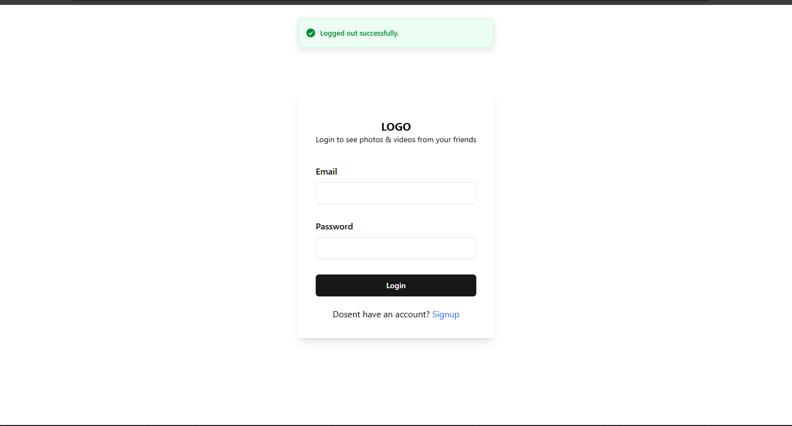
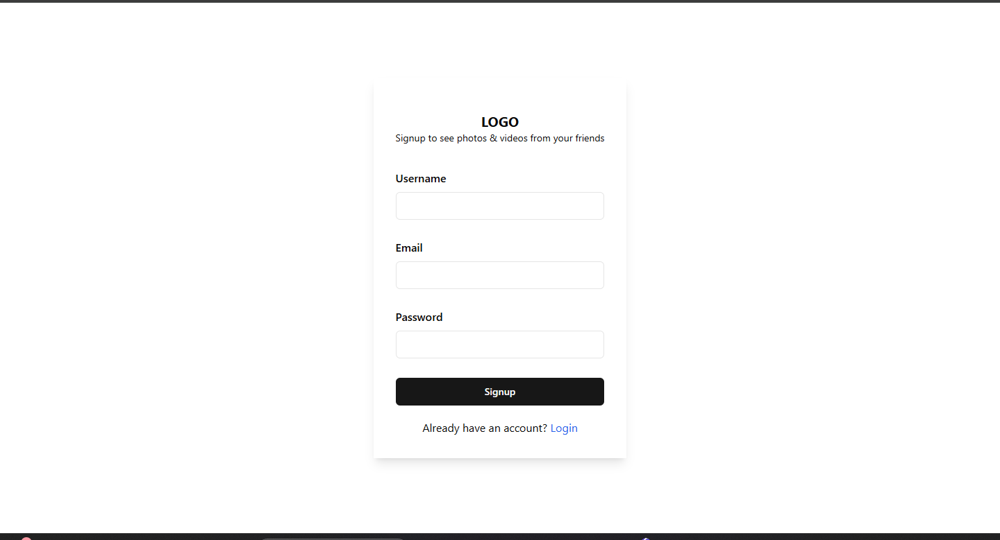
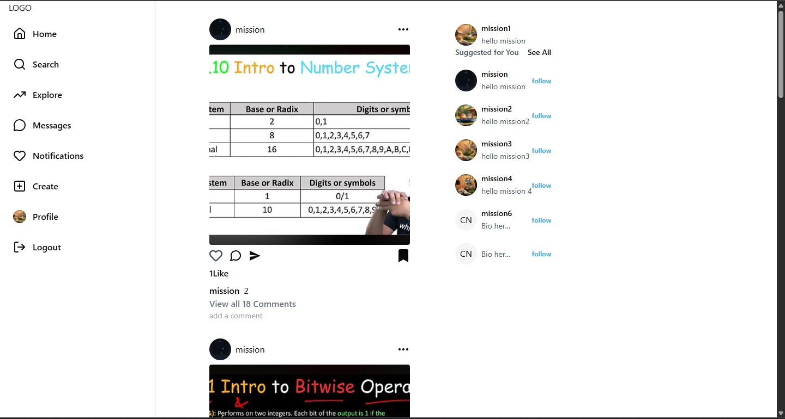
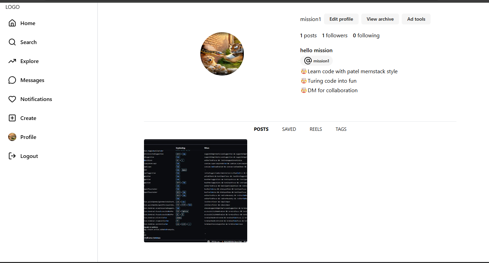
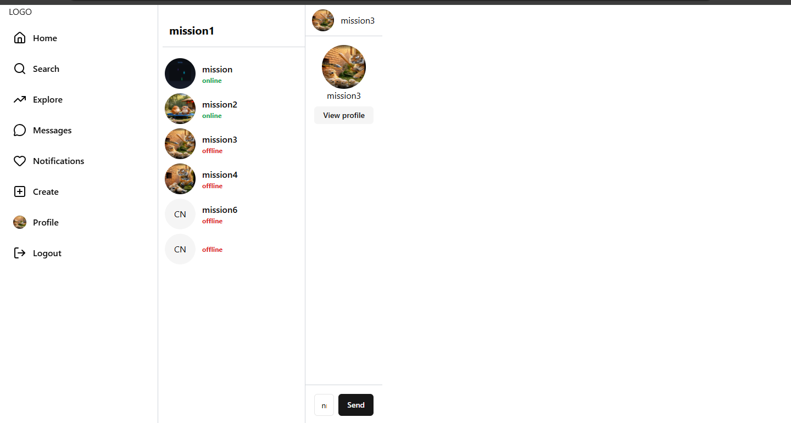
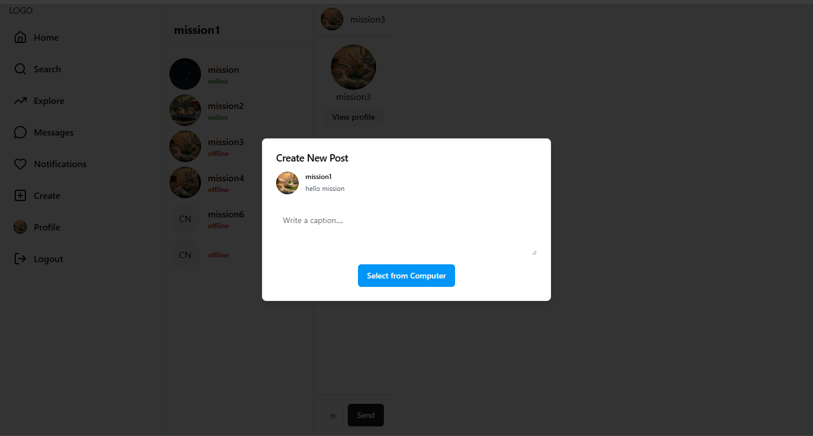
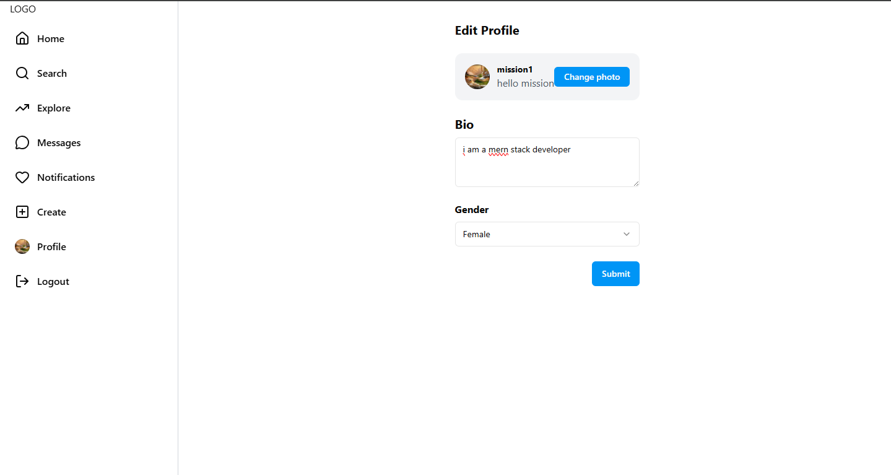

# 📸 Instagram Clone – MERN Stack

A full-stack Instagram clone built using the **MERN stack** with real-world features like authentication, posts, follow system, real-time chat, and profile management.

This project focuses on **clean UI**, **scalable backend**, and **modern React patterns**.

---

## 🖼 Screenshots

### 🔐 Login Page


### 📝 Signup Page


### 🏠 Home Feed


### 👤 Profile Page


### 👥 Other User Profile


### 💬 Messaging


### ➕ Create Post


### ✏️ Edit Profile


---

## 🚀 Features

### 🔐 Authentication
- Signup & Login
- JWT-based authentication
- Secure password hashing
- Logout support

### 🏠 Feed & Posts
- Create image posts
- Like & comment on posts
- View posts from other users

### 👤 User Profile
- Profile photo & bio
- Followers / following count
- View own & other users’ profiles
- Edit profile details

### 🧑‍🤝‍🧑 Follow System
- Follow / unfollow users
- Suggested users section

### 💬 Real-Time Chat
- One-to-one messaging
- Online / offline status
- Socket.io integration

### 🧭 Navigation
- Home
- Search
- Explore
- Messages
- Notifications
- Create Post
- Profile
- Logout

---

## 🛠 Tech Stack

### Frontend
- React.js
- Vite
- Redux Toolkit
- React Router
- Tailwind CSS
- Axios

### Backend
- Node.js
- Express.js
- MongoDB
- Mongoose

### Real-Time
- Socket.io

### Other Tools
- Multer (image upload)
- Cloudinary (media storage)
- JWT (authentication)
- bcrypt (password hashing)

---

## 📂 Folder Structure

### 📦 Root
insta-clone/
├── client/
├── server/
├── screenshots/
├── .gitignore
└── README.md

yaml
Copy code

---

### 🖥 Client (Frontend)
client/
├── public/
├── src/
│ ├── assets/ # Static assets
│ ├── components/
│ │ ├── ui/ # Reusable UI components
│ │ ├── ChatPage.jsx
│ │ ├── Comment.jsx
│ │ ├── CreatePost.jsx
│ │ ├── EditProfile.jsx
│ │ ├── Feed.jsx
│ │ ├── Home.jsx
│ │ ├── Login.jsx
│ │ ├── Signup.jsx
│ │ ├── Profile.jsx
│ │ └── SuggestedUsers.jsx
│ │
│ ├── hooks/
│ │ ├── useGetAllPost.jsx
│ │ ├── useGetAllMessage.jsx
│ │ ├── useGetSuggestedUser.jsx
│ │ └── useGetUserProfile.jsx
│ │
│ ├── redux/
│ │ ├── authSlice.js
│ │ ├── chatSlice.js
│ │ ├── postSlice.js
│ │ ├── socketSlice.js
│ │ └── store.js
│ │
│ ├── utils/
│ │ └── constant.js
│ │
│ ├── App.jsx
│ ├── main.jsx
│ └── index.css
│
├── tailwind.config.js
├── vite.config.js
└── package.json

yaml
Copy code

---

### 🖧 Server (Backend)
server/
├── controllers/
│ ├── user.controller.js
│ ├── post.controller.js
│ └── message.controller.js
│
├── models/
│ ├── user.model.js
│ ├── post.model.js
│ ├── comment.model.js
│ ├── conversation.model.js
│ └── message.model.js
│
├── routes/
│ ├── user.route.js
│ ├── post.route.js
│ └── message.route.js
│
├── middlewares/
│ ├── isAuthenticated.js
│ └── multer.js
│
├── utils/
│ ├── db.js
│ ├── cloudinary.js
│ └── datauri.js
│
├── index.js
├── .env
└── package.json

yaml
Copy code

---

## ⚙️ Installation & Setup

### 1️⃣ Clone Repository
```bash
git clone https://github.com/your-username/instagram-clone.git
cd instagram-clone
2️⃣ Backend Setup
bash
Copy code
cd server
npm install
npm run dev
Explain .env:

env
Copy code
PORT=5000
MONGO_URI=your_mongodb_url
JWT_SECRET=your_secret
CLOUDINARY_NAME=xxx
CLOUDINARY_API_KEY=xxx
CLOUDINARY_API_SECRET=xxx
3️⃣ Frontend Setup
bash
Copy code
cd client
npm install
npm run dev
🎯 Future Improvements
Stories

Reels

Real-time notifications

Dark mode 🌙

Save posts

User & hashtag search

👨‍💻 Author
Mission Kumar
MERN Stack Developer
🧠 Learn code with modern stack
🚀 Turning code into fun
📩 DM for collaboration

⭐ Show Some Love
If you like this project:

⭐ Star the repository

🍴 Fork it

🔥 Build something cool on top of it